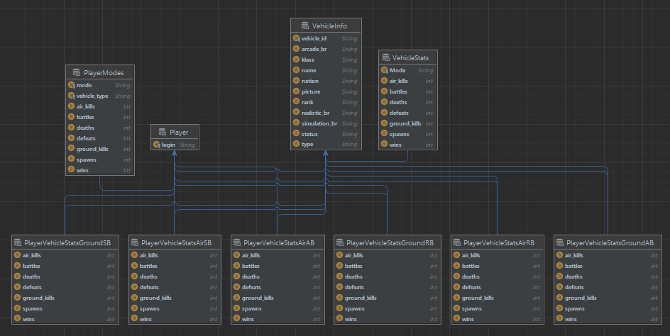
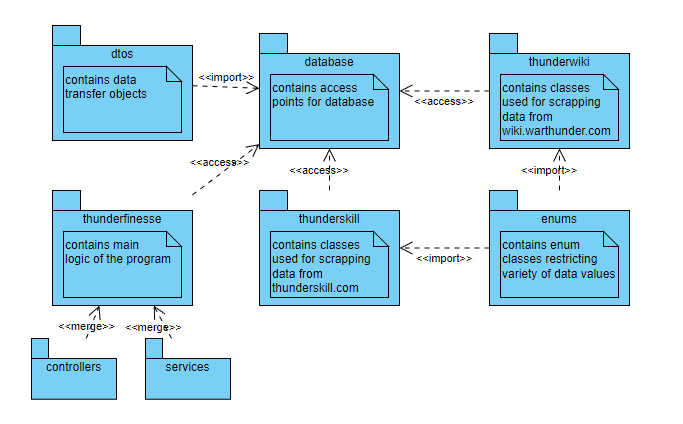
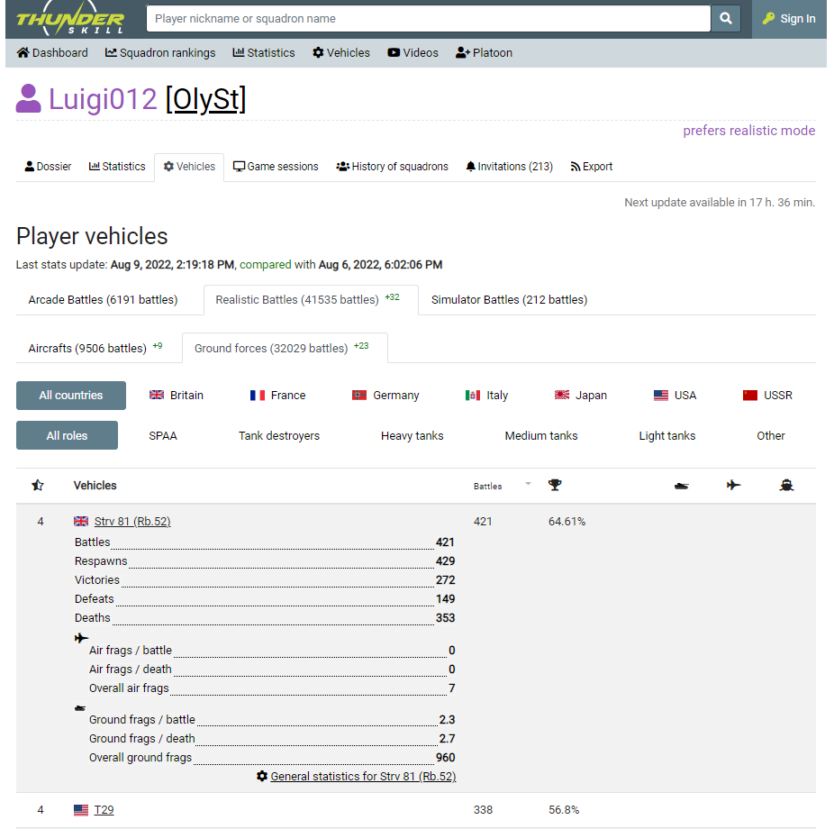
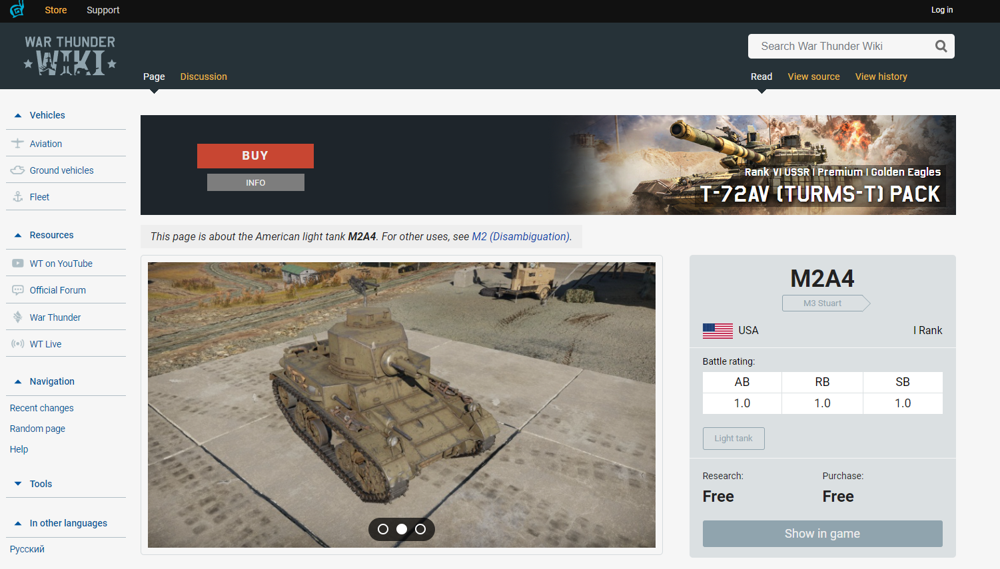

# Thunder Finesse
Spring boot REST application scrapping data from thunderskill.com and 
wiki.warthunder.com Juxtaposes information about players effectivity with 
vehicle details. Uses postgresql with JPA

## Endpoints
### [GET] /player/{login}
Returns information about given player effectiveness in each mode
### [GET] /player/{login}/Vehicles?mode={mode}
Returns information about given player effectiveness in each vehicle for given mode. 
  Possible modes = {air_ab, air_rb, air_sb, ground_ab, ground_rb, ground_sb}
### [POST] /player/{login}
Updates player information (scrapes data from thunderskill.com)
### [GET] /vehicles/{vehicle_id}
Returns information about given vehicle (details scrapped from wiki.warthunder.com)
### [GET] /vehicles?mode={mode}
Returns information about average effectiveness of each vehicle in given mode
  Possible modes = {air_ab, air_rb, air_sb, ground_ab, ground_rb, ground_sb}

## Database
PostgreSQL + JPA. Uses multiple PlayerVehiclesStats tables 
(separate for each mode) due to optimization.

## Packages

## Datasource
### [thunderskill.com](https://thunderskill.com/en)

### [wiki.warthunder.com](https://wiki.warthunder.com/Main_Page)
